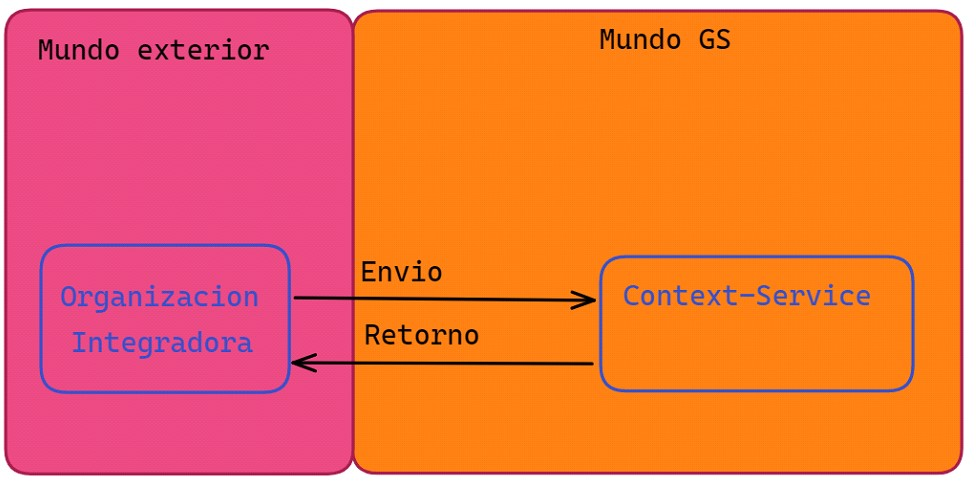
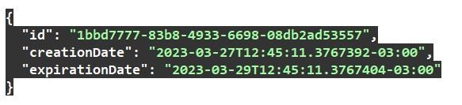

# Integraciones Launchpad.

El ecosistema de launchpad expone diferentes endpoint para lograr una integración completa con nuestra aplicación. Desde una perspectiva sencilla la integración siempre recorrerá los siguientes pasos al menos de momento.

1-Cliente/Organización externa invoca al servicio de contexto.

2-Servicio de Contexto: Según que endpoint se use este servicio retornar una url o un id.

3-Cliente/Organización debe decidir qué acción tomar en base a que endpoint de **service context** uso.

### Gráfico para simplificar la idea 

La flecha en relacionada al “Envio”  indica que quien se integre deberá enviarnos un set de datos el cual se reciben en el MundoGS el nombre por el cual se lo conoce es “Contexto o Context”.
Este set de datos son un conjunto de datos mínimos requeridos para poder hacer funcionar los sistemas de GS en este caso se armara un objeto que puede llegar a contener datos como por ejemplo.

1-**Datos de la organización** (Necesarios para que MundoGS sepa quién es el que llama y usa el sistema).

2-**Datos de empleados de la organización**(en el caso de que la implementación sea en un canal que sea manejado por empleados de la organización).

3-**Datos personales del cliente**(Referentes a la persona a la cual se le quiere vender el producto) estos pueden contener más o menos información pero siempre existe un mínimo.

Básicamente el contexto consta de 3 partes principales.

1-Bloque **customer** = Contiene información base del cliente.

2-Bloque **channel** = Contiene información de la organización que envía el contexto para ubicarla en nuestro sistema.

3-Bloque  **transaction** = Contiene información que se usa en las integraciones contra el CRM engage interno de Galicia Seguros.

Depende de a que endpoint del Servicio de contexto **(Context-Service)** se invoque la repuesta puede cambiar para dar la posibilidad al invocador (Organización integradora) de elegir que hacer en cada caso.

Por ejemplo dentro de **context-service** existe el endpoint 

 
Este endpoint crea un contexto y retorna su ID.

### Ejemplo response caso 1

Quedara por cuenta del cliente el armar la url de launchpad con el id de contexto

### [Hace click para ver un ejemplo](https://dev.integradordeseguros.com/launchpad/?idContext=1bbd7777-83b8-4933-6698-08db2ad53557)

El parámetro **“idContext”**  es el identificador creado en la llamada del post anterior.

Invocando a la url de launchpad se renderizara el front con todos los producto configurados para dicha organización.

Existen otros endpoint de carácter similar es decir también reciben un contexto pero en algunos casos lo que permiten es enviar el contexto en vez de en un formato JSON en un formato TXT o encriptado bajo algún estándar definido con la organización.
Pero estos actualmente están en de desarrollo o son específicos para algunas de nuestras organización las cuales ya están integradas a nosotros.